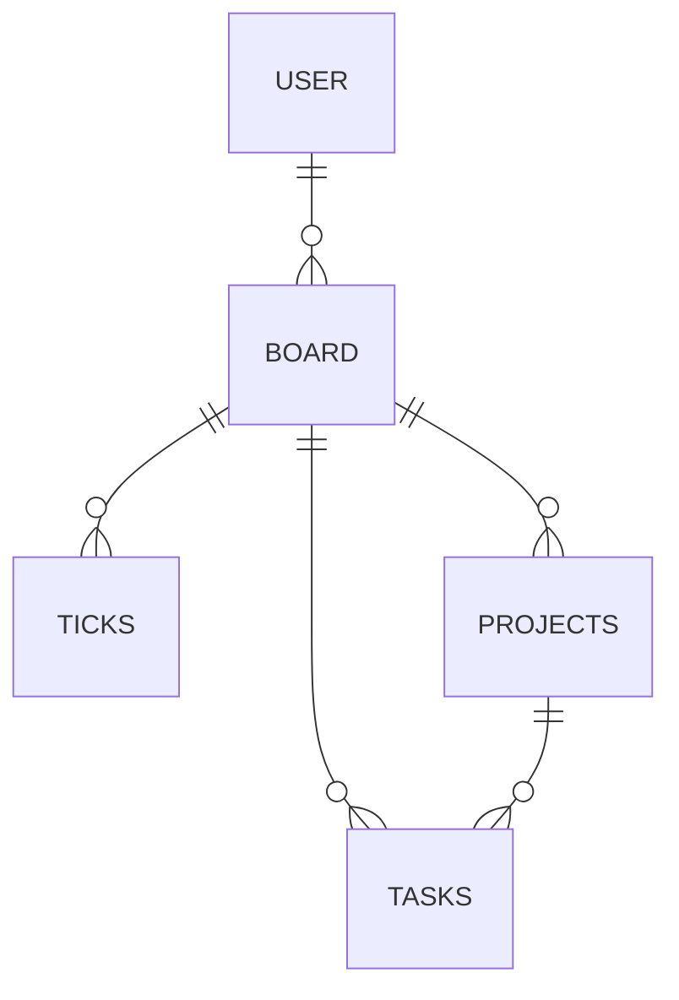
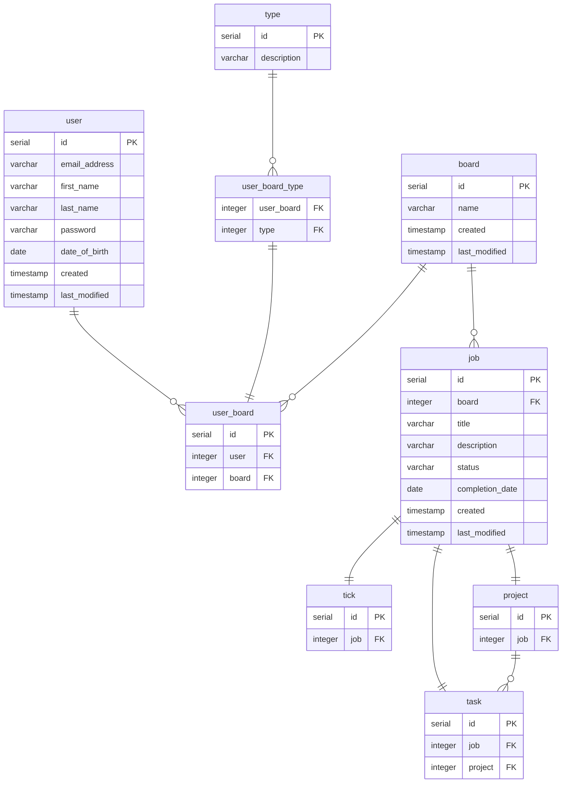

# The Productivity Method

## What is the application?

A digital interpretation of the Productivity Method by Grace Beverley. This productivity app will allow the user to track jobs to do under the 3 main categories.

- Quick Ticks => 5 minutes or less
- Tasks => 5-30 minutes
- Projects => collection of tasks 

By breaking up tasks onto a visual board rather than a single list, which can be daunting, this reduces the pressure to follow tasks in order and can allow for grouping or potentially sharing boards among other users. The user can choose to select 3 non-negotiable tasks they aim to complete in the day.

## Why

The aim is to provide accountabilty to users, with a variation on task management they may be familiar in other applications. Organising work into categories and prioritising work can aid in reducing the stress of users.

## MVP

- User account creation/login
- Create Ticks/Tasks/Projects
- Track status of tasks
- Users can share/view other users boards
- Filter tasks by project
- Simple view with 3 ticks/tasks to complete (updates on completion of task)

## Stretch Goals

- Progress Bar
- Read/Write permissions for shared boards
- Mind Mapping (Mermaid js experimental)
- View completed (inactive) tasks

## Domain Model



# Entity Relationship Diagram

# API Specification

#### USERS
`GET /users`
Return a list of all users

Response 200
```json
[
  {
    "id": 1,
    "email_address": "lorna@lorna.com",
    "first_name": "Lorna",
    "last_name": "McKinley",
    "password": "password",
    "date_of_birth": "1996-09-26",
    "created": "2022-12-12 14:29:20.012024",
    "last_modified": "2022-12-12 14:29:20.012024"
  },
  {
    "id": 2,
    "email_address": "jane@jane.com",
    "first_name": "Jane",
    "last_name": "McKinley",
    "password": "password2",
    "date_of_birth": "1986-11-26",
    "created": "2022-12-14 14:29:20.012024",
    "last_modified": "2022-12-14 14:29:20.012024"
  }
]
```

---

`GET /users/{user_id}`
Return a user

Response 200
```json
  {
    "id": 1,
    "email_address": "lorna@lorna.com",
    "first_name": "Lorna",
    "last_name": "McKinley",
    "password": "password",
    "date_of_birth": "1996-09-26",
    "created": "2022-12-12 14:29:20.012024",
    "last_modified": "2022-12-12 14:29:20.012024"
  }
```

---

`POST /users`
Create a user

Request
```json
{
  "email_address": "pat@pat.com",
    "first_name": "Patrick",
    "last_name": "Tazz",
    "password": "password3",
    "date_of_birth": "1995-07-14",
    "created": "2022-12-18 14:29:20.012024",
    "last_modified": "2022-12-18 14:29:20.012024"
}
```
Response - `201 Created`

---

`PATCH /users/{user_id}`
Update a user by id

Request
```json
{
"password": "password2"
}
```
Response - `200 OK`

---

`DELETE /users/{user_id}`
Delete a user by id

Response - `204 No Content`

---

#### BOARDS
`GET /boards/user/{user_id}`
Return all boards for a user

Response 200
```json
[
  {
    "id": 5,
    "name": "Lorna's Board",
    "last_modified": "2022-11-12 14:29:20.012024"
  },
 {
    "id": 6,
    "name": "Christmas Party",
    "last_modified": "2022-12-12 14:29:20.012024"
  }
]
```

---

`GET /boards/{board_id}`
Return a board by id

Response 200
```json
{
"board":{
  "id": 5,
  "name": "Lorna's Board",
  "owner": 1
  "created": "2022-12-12 14:29:20.012024",
  "last_modified": "2022-11-12 14:29:20.012024",
  "ticks": [
    "id": 123,
    "title": "aTitle",
    "description": "aDescription"
  ],
  "tasks": [
    "id": 123,
    "title": "aTitle",
    "description": "aDescription"
  ],
  "projects": [
    "id": 123,
    "title": "aTitle",
    "description": "aDescription"
  ]
 }
}
```
---


`POST /boards`
Create a board

Request
```json
{
  "name": "Jane's Board",
}
```
Response - `201 Created`

---

`PATCH /boards/{board_id}`
Update a board by id

Request
```json
{
"title": "Halloween Party",
"last_modified": "2022-12-18 14:29:20.012024"
}
```
Response - `200 OK`

---

`DELETE /boards/{board_id}`
Delete a board by id

Response - `204 No Content`
